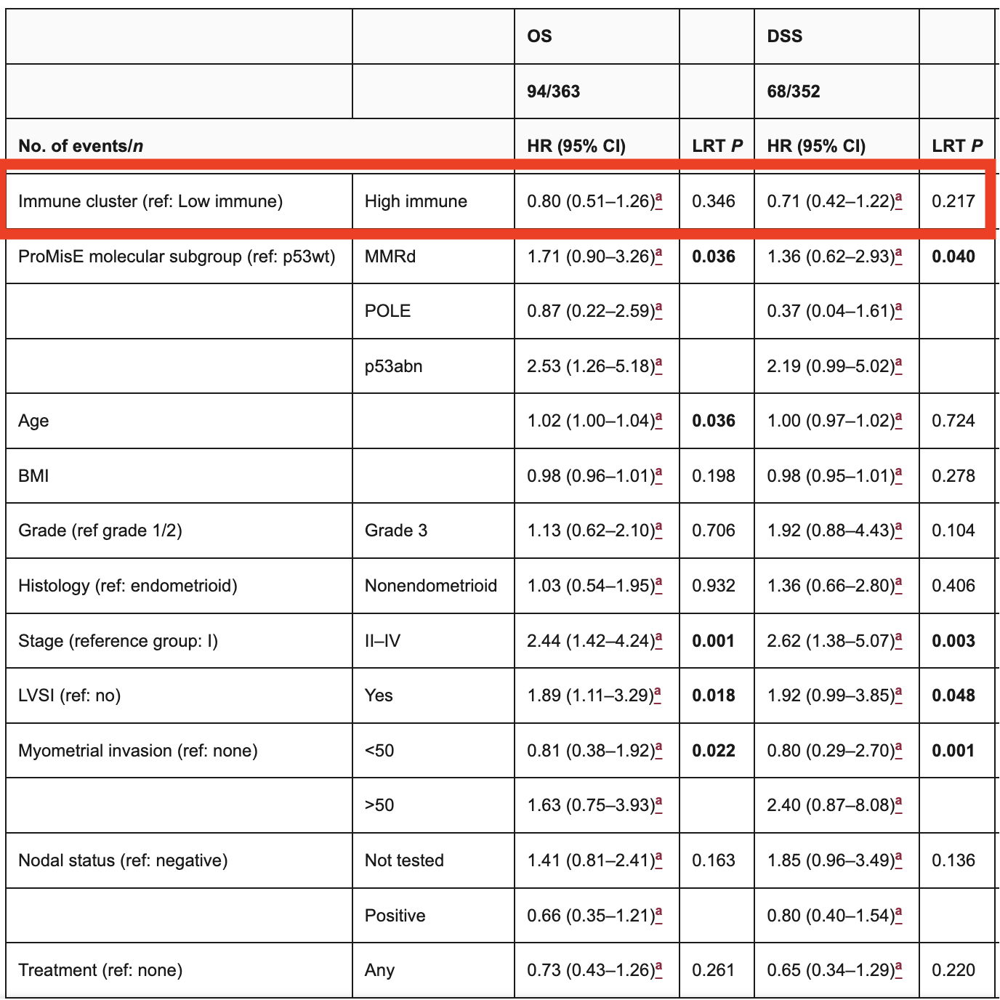
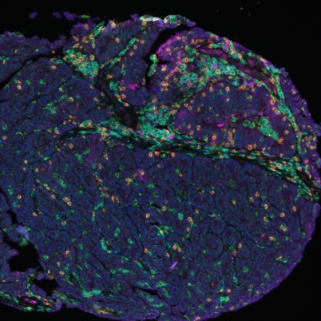
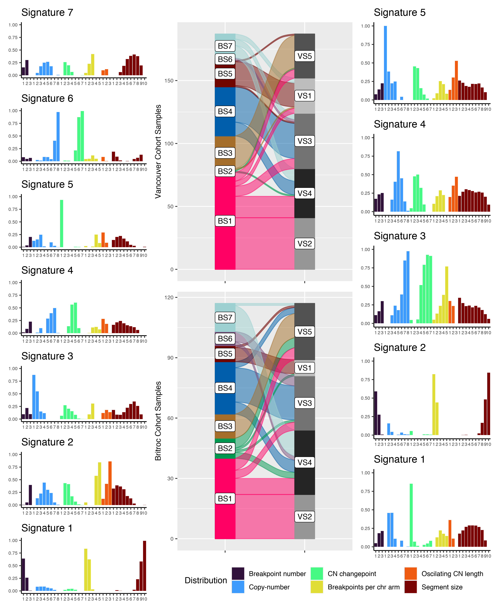
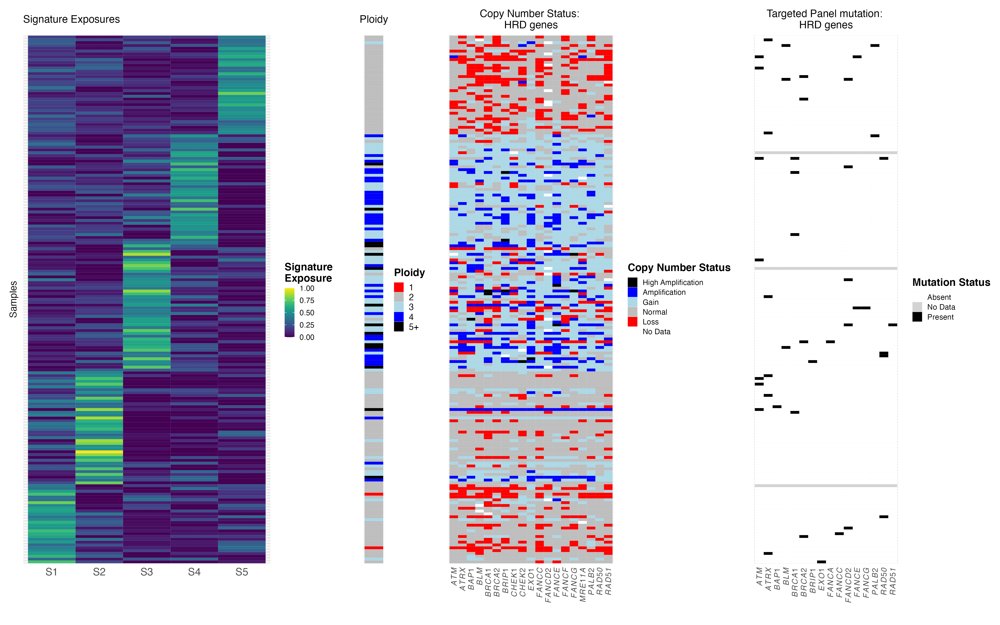

```{r include = FALSE}
knitr::knit_child("../../notebooks/b_t_analysis.Rmd")
```

```{r, include=FALSE}
knitr::opts_chunk$set(echo = FALSE, tidy = TRUE, warning = FALSE, message = FALSE, cache = TRUE, cache.lazy = FALSE, fig.width = 8, fig.height = 4.5)
```

# Background

## Tumour-infiltrating lymphocytes and clinical outcomes in endometrial carcinoma

* Evidence in HGSOC suggests good prognosis of TILs, specifically intraepithelial TILs
* Talhouk et al. 2019 show that TILs are not associated with longer survival in endometrial carcinoma

```{r, out.width = '50%', fig.cap='Talhouk et al. CCR 2019'}

```

## Data

```{r}
metatable_bt <- til_data %>%
  dplyr::select(tma, acc_num) %>%
  mutate(`B & T` = TRUE,
         tma=str_replace_all(tma, "[AB]$", "")) %>%
  unique

metatable_clinical <- clinical_data_unique %>%
  dplyr::select(cohort, acc_num, age_dx, eclass2_ngs, stage_full, grade_rev, hist_rev, lvi, nodes, myo, neoadj, chemo, rt, brachy) %>%
  unique

angio_tab <- read_tsv("../../results/non_erg_data.tsv")

metatable_angio <- angio_tab %>%
  dplyr::select(tma, acc_num) %>%
  mutate(angiogenesis = TRUE,
         tma=str_replace_all(tma, "[AB]$", "")) %>%
  unique

colorscheme_brewer <- function(x, palname) {
  a <- brewer.pal(length(unique(na.omit(x))), palname)
  names(a) <- unique(na.omit(sort(x)))
  return(a)
}

metatable_full <- metatable_bt %>%
  full_join(metatable_angio) %>%
  full_join(metatable_clinical) %>%
  mutate(
    angiogenesis = replace_na(angiogenesis, FALSE),
    `B & T` = replace_na(`B & T`, FALSE)
  ) %>%
  filter(!is.na(tma), !is.na(acc_num)) %>%
  mutate(stage_main=str_extract(stage_full, "I*V*"),
         grade_rev = str_extract(grade_rev, "[0-9]+")) %>%
  dplyr::select(-c(stage_full)) %>%
  rename(TMA=tma, Cohort=cohort, Subtype=eclass2_ngs, Angiogenesis=angiogenesis, Age=age_dx, Stage=stage_main, Grade=grade_rev, Histotype=hist_rev,
         LVI=lvi, Nodes=nodes, Myo=myo, Neoadjuvant=neoadj, Chemotherapy=chemo, Radiotherapy=rt, Brachytherapy=brachy) %>%
  mutate(
    TMA = factor(TMA, levels = c("10-005", "10-006", "22-004")),
    `B & T` = factor(dplyr::recode(as.character(`B & T`), 'FALSE'='No', 'TRUE'='Yes'), levels = c('Yes', 'No')),
    Angiogenesis = factor(dplyr::recode(as.character(Angiogenesis), 'FALSE'='No', 'TRUE'='Yes'), levels = c('Yes', 'No')),
    Grade = factor(Grade, levels = c("1", "2", "3")),
    LVI = factor(LVI, levels = c("negative","focal", "positive", "extensive")),
    Nodes = factor(Nodes, levels = c("negative", "positive", "not tested")),
    Myo = factor(Myo, levels = c("none", "1-50%", ">50%")),
    Neoadjuvant = factor(Neoadjuvant, levels = c("chemo only", "horm only", "RT only", "yes/NOS", "none")),
    Chemotherapy = factor(dplyr::recode(as.character(Chemotherapy), 'FALSE'='No', 'TRUE'='Yes'), levels = c('Yes', 'No')),
    Radiotherapy = factor(dplyr::recode(as.character(Radiotherapy), 'FALSE'='No', 'TRUE'='Yes'), levels = c('Yes', 'No')),
    Brachytherapy = factor(dplyr::recode(as.character(Brachytherapy), 'FALSE'='No', 'TRUE'='Yes'), levels = c('Yes', 'No')),
    Stage = factor(Stage, levels = c("I", "II", "III", "IV"))
  ) %>%
  arrange(TMA, Subtype, Cohort)

cohort_plot_bottom <- columnAnnotation(df = metatable_full %>% dplyr::select(-c(acc_num, TMA, `B & T`, Angiogenesis)) %>% as.data.frame, 
                                       col = list(
                                         Cohort=c("Cross Canada"="#D90368",
                                                  "Historic Vancouver"="#7F95D1"),
                                         Age=colorRamp2(c(min(metatable_full$Age, na.rm = TRUE),  max(metatable_full$Age, na.rm = TRUE)), c("white", "#2E294E")),
                                         Subtype=colorscheme_brewer(metatable_full$Subtype, 'Set2'),
                                         Grade=colorscheme_brewer(metatable_full$Grade, 'Oranges'),
                                         Histotype=colorscheme_brewer(metatable_full$Histotype, 'Set3'),
                                         LVI=colorscheme_brewer(metatable_full$LVI, 'Purples'),
                                         Nodes=c("negative"="#E6EBE0", "positive"="#36C9C6", "not tested"="#696773"),
                                         Myo=colorscheme_brewer(metatable_full$Myo, 'Reds'),
                                         Neoadjuvant=colorscheme_brewer(metatable_full$Neoadjuvant, 'Set2'),
                                         Chemotherapy=c('Yes'="#2E282A",
                                                        'No'="#E7ECEF"),
                                         Radiotherapy=c('Yes'="#2E282A",
                                                        'No'="#E7ECEF"),
                                         Brachytherapy=c('Yes'="#2E282A",
                                                         'No'="#E7ECEF"),
                                         Stage=colorscheme_brewer(metatable_full$Stage, 'Reds')
                                       ))
cohort_plot_top <- columnAnnotation(df = metatable_full %>% dplyr::select(c(TMA, `B & T`, Angiogenesis)) %>% as.data.frame, 
                                    col = list(
                                      TMA=c("10-005"="#88A096",
                                            "10-006"="#BBAB8B",
                                            "22-004"="#8A4F7D"),
                                      `B & T`=c('Yes'="#2E282A",
                                                'No'="#E7ECEF"),
                                      Angiogenesis=c('Yes'="#2E282A",
                                                     'No'="#E7ECEF")
                                    ))
```

```{r, fig.width = 19, fig.height = 7, fig.align = 'center'}
cohort_track <- Heatmap(matrix(nc = nrow(metatable_full), nr = 0), 
	top_annotation = cohort_plot_top, bottom_annotation = cohort_plot_bottom)

draw(cohort_track, annotation_legend_side = "bottom")
```


# TILs in p53abn endometrial carcinoma

## Multi-channel immunofluorescence

```{r, out.width = '40%', fig.cap='Spencer Martin, Christine Chow, Shelby Thornton'}

```

## TIL densities

```{r, fig.width = 12, fig.height = 6, fig.align = 'center'}
density_map <- c(dens_bcell_cd20pos_tumour="Tumour: B cell",
                 dens_bcell_cd20neg_tumour="Tumour: Plasma",
                 dens_tcyto_tumour="Tumour: CD8+",
                 dens_thelper_tumour="Tumour: CD4+",
                 dens_treg_tumour="Tumour: Treg",
                 dens_bcell_cd20pos_stroma="Stroma: B cell",
                 dens_bcell_cd20neg_stroma="Stroma: Plasma",
                 dens_tcyto_stroma="Stroma: CD8+",
                 dens_thelper_stroma="Stroma: CD4+",
                 dens_treg_stroma="Stroma: Treg")

density_distributions <- til_data_long %>%
  filter(str_detect(variable, "^dens")) %>%
  filter(!str_detect(variable, "cd8tcell_foxp3pos")) %>%
  mutate(variable = dplyr::recode(variable,
                                  !!!density_map,
                                  )) %>%
  ggplot(aes(x = value)) +
  geom_histogram(bins = 30, fill = "lightblue", color = "black") +
  scale_x_continuous(trans = 'log1p', breaks = c(0, 1, 10, 100, 1000, 10000),
                     labels = c("0", "1", "10", "100", "1000", "10000")) + 
  facet_wrap(vars(variable), scales = "free") +
  theme_pubr() +
  xlab("Density") + 
  ylab("Count")

density_distributions
```

## Nonparametric clustering of TIL densities

```{r, fig.width = 10, fig.height = 5, fig.align = 'center'}
input_mat <- scale(til_densities_heatmap_input %>% na.omit)
colnames(input_mat) <- dplyr::recode(colnames(input_mat), !!!density_map)

row_hclust <- hclust(dist(input_mat), method = "ward.D2")
col_hclust <- hclust(dist(t(input_mat)), method = "ward.D2")

nclust <- 2
til_clusters <- cutree(row_hclust, nclust)
names(til_clusters) <- rownames(input_mat)

row_anno <- clinical_anno[rownames(input_mat),]
row_anno$til_clusters <- factor(unname(til_clusters))
hist_mapping <- c("endometrioid (squamous)" = "endometrioid", 
                  "mixed endometrioid and serous" = "mixed", 
                  "mixed serous and moderately differentiated" = "mixed",
                  "undifferentiated" = "undiff/dediff",
                  "dedifferentiated" = "undiff/dediff")

clust_color_map <- brewer.pal(n = nclust, 'Set2')[1:nclust]
names(clust_color_map) <- 1:nclust

row_anno <- row_anno %>%
  mutate(hist_rev = case_when(
    hist_rev %in% names(hist_mapping) ~ hist_mapping[hist_rev],
    TRUE ~ hist_rev 
  )) %>%
  rename(
    TMA=tma,
    Grade=grade_rev,
    Histotype=hist_rev,
    Neoadjuvant=neoadj,
    Subtype=eclass2_ngs,
    TILclust=til_clusters
  )

ha <- rowAnnotation(df = row_anno, annotation_width = 0.02, col = list(TILclust = clust_color_map))

density_heatmap <- Heatmap(input_mat,
                           na_col = "gray",
                           column_names_gp = gpar(fontsize = 6), 
                           cluster_rows = row_hclust,
                           cluster_columns = col_hclust,
                           column_names_rot = 45, 
                           show_row_names = FALSE) + ha


draw(density_heatmap, heatmap_legend_side = "right")
```

## Univariate survival analysis: all molecular subtypes

```{r, fig.width = 14, fig.height = 6}
# Subset for p53abn
outcomes <- til_clusters_clinical_long$outcome %>% unique

fit_data <- lapply(outcomes, function(x) {
  til_clusters_clinical_long %>% 
    filter(outcome == x) %>%
    rename(TILclust=til_cluster)
})
names(fit_data) <- outcomes

fits <- lapply(outcomes, function(x) {
  survfit(Surv(time, status) ~ TILclust, 
          data = fit_data[[x]])# %>% filter(eclass2_ngs == "p53abn"))
})
names(fits) <- outcomes

kmplots <- lapply(outcomes, function(x) {
  ggsurvplot(fits[[x]], 
             data = fit_data[[x]],
             pval = TRUE,
             pval.method = TRUE,
             conf.int = TRUE,
             risk.table = TRUE, 
             ggtheme = theme_pubr() + theme(plot.title = element_text(hjust = 0.5, face = "bold")),
             legend = "none",
             title = toupper(x))
})

arrange_ggsurvplots(kmplots, print = TRUE, 
  ncol = 3, nrow = 1, risk.table.height = 0.25)
```

## Univariate survival analysis: p53abn

```{r, fig.width = 14, fig.height = 6}
# Subset for p53abn
outcomes <- til_clusters_clinical_long$outcome %>% unique

fit_data <- lapply(outcomes, function(x) {
  til_clusters_clinical_long %>% 
    filter(outcome == x) %>%
    filter(eclass2_ngs=="p53abn") %>%
    rename(TILclust=til_cluster)
})
names(fit_data) <- outcomes

fits <- lapply(outcomes, function(x) {
  survfit(Surv(time, status) ~ TILclust, 
          data = fit_data[[x]])# %>% filter(eclass2_ngs == "p53abn"))
})
names(fits) <- outcomes

kmplots <- lapply(outcomes, function(x) {
  ggsurvplot(fits[[x]], 
             data = fit_data[[x]],
             pval = TRUE,
             pval.method = TRUE,
             conf.int = TRUE,
             risk.table = TRUE, 
             ggtheme = theme_pubr() + theme(plot.title = element_text(hjust = 0.5, face = "bold")),
             legend = "none",
             title = toupper(x))
})

arrange_ggsurvplots(kmplots, print = TRUE, 
  ncol = 3, nrow = 1, risk.table.height = 0.25)
```

## Multivariate survival analysis: p53abn

Cox proportional hazards analysis, where TILclusthigh corresponds to cores in the high TIL cluster.  

```{r, fig.align = 'center'}
cox_table_p53abn <- lapply(outcomes, function(x) {
  dat <- fit_data[[x]] %>%
    filter(eclass2_ngs == "p53abn") %>%
    mutate(age_dx=scale(age_dx)) %>%
    mutate(TILclust=dplyr::recode(factor(TILclust), `1`="high", `2`="low") %>% factor(levels = c("low", "high")),
           lvi = factor(lvi, levels = c("negative", "focal", "positive", "extensive")),
           stage_main=str_extract(stage_full, "I*V*"))
  coxres <- coxph(Surv(time, status) ~ TILclust + age_dx + chemo + rt + brachy + stage_main,
                  data = dat)
  
  coeftable <- summary(coxres)$coefficients %>%
      bind_cols(summary(coxres)$conf.int[,3:4]) %>%
      as_tibble() %>%
      mutate(variable = rownames(summary(coxres)$coefficients)) %>%
      mutate(
        outcome=x
      )
    coeftable
}) %>% bind_rows()

ggplot(cox_table_p53abn, aes(y=variable, group=outcome, colour=outcome)) + 
  geom_point(aes(x=`exp(coef)`), position=position_dodge(width=0.5), shape=15, size=3) + 
  geom_linerange(aes(xmin=`lower .95`, xmax=`upper .95`), position=position_dodge(width=0.5)) + 
  theme_pubr() + 
  geom_vline(xintercept = c(0.1, 0.2, 0.5, 2, 4), linetype = 3) + 
  geom_vline(xintercept = 1, alpha = 0.7) + 
  ylab("") + 
  scale_y_discrete(limits = rev) + 
  scale_colour_manual(values = brewer.pal(3, "Set2")) + 
  xlab("Hazard ratio") + 
  scale_x_continuous(trans = "log", breaks = c(0.1, 0.2, 0.5, 1, 2, 4))
```

## TIL densities and survival

<br />
<br />

* At first glance, there's a trend towards an association between high TIL density and survival. 
* However, this does not reach statistical significance at *P < 0.05*. 
* However, unsupervised clustering of densities is suboptimal for several reasons:
  * Information is lost by using densities rather than counts directly

## Advantages of directly using count data

<br />
<br />

Same densities, but different levels of confidence:

* 100 T cells in a 50 mm^2 intraepithelial region
* 2 T cells in a 1 mm^2 intraepithelial region

How do we leverage this information?

## Mixture modeling of TIL counts

We describe TIL counts $y_{i,c,r}$ for a given core $i$, cell type $t$, and region (tumour/stroma) $r$ as follows:

$$
y_{i,t,r} \sim \mathcal{NB}(\mu_{i,t,r}, \alpha_{i,t,r})
$$

where the mean $\mu_{i,t,r}$ is **proportional to the TMA core's area** $A$ and a latent variable $z$ for each cluster:

$$
\begin{aligned}
\mu_{i,t,r} &= A_{i,r} z_{c_i,t,r} \\
z_{c,t,r} &\sim \mathcal{Gamma}(\bar{\mu}_{t,r}, 100)
\end{aligned}
$$
Then, we leverage the proportionality between the Cox likelihood and a Poisson likelihood to incorporate uncertainty in cluster assignment into the survival analysis. 

$$
\begin{aligned}
\lambda_0 &\sim \mathcal{Gamma}(0.1, 0.1) \\
\lambda_i &= \lambda_0\exp(\sum_v \beta_{v,i}x_{v,i}) \\
d_i &\sim \mathcal{Poisson}(\lambda_i * p_i)
\end{aligned}
$$

## TIL counts are overdispersed

```{r, fig.width=12, fig.height=6}
ggplot(til_densities_sum_long, aes(x=count, y=var_count)) + 
  geom_point(alpha = 0.3) +
  stat_smooth(method="loess", colour="blue", alpha = 0.3) + 
  facet_wrap(~ variable) + 
  theme_minimal() + 
  scale_x_continuous(trans = "log1p", breaks = c(0, 1, 10, 100, 1000, 10000)) + 
  scale_y_continuous(trans = "log1p", breaks = c(0, 1, 10, 100, 1000, 10000)) + 
  geom_abline(slope=1, colour='red', alpha = 0.3) + 
  xlab("Count") + 
  ylab("Variance")
```

## Mixture model-based clustering of TIL densities

```{r}
density_heatmaps <- lapply(outcomes, function(outcome_type) {
  row_anno <- clinical_anno[rownames(til_densities_heatmap[[outcome_type]]$mat),] %>%
    bind_cols(til_densities_heatmap[[outcome_type]]$clust) %>%
    mutate(hist_rev = case_when(
      hist_rev %in% names(hist_mapping) ~ hist_mapping[hist_rev],
      TRUE ~ hist_rev 
    ),
    clust=factor(clust)) %>%
    rename(
      TMA=tma,
      Grade=grade_rev,
      Histotype=hist_rev,
      Neoadjuvant=neoadj,
      Subtype=eclass2_ngs,
      TILclust=clust
    )
  
  clust_color_map <- c('0'='#60B2E5',
                       '1'='#A4031F')
  
  ha <- rowAnnotation(df = row_anno, annotation_width = 0.02,
                      col = list(
                        TILclust=clust_color_map
                      ))
  col_fun <- colorRamp2(c(-2, 0, 2), c("blue", "white", "red"))
  
  density_map2 <- density_map
  names(density_map2) <- str_replace_all(names(density_map2), "^dens_", "")
  
  mat <- sqrt(exp(til_densities_heatmap[[outcome_type]]$mat)-1) %>% scale
  colnames(mat) <- dplyr::recode(colnames(mat), !!!density_map2)
  mat <- mat[,!str_detect(colnames(mat), "cd8tcell_foxp3pos")]
  
  density_heatmap <- Heatmap(mat,
                             na_col = "gray",
                             column_names_gp = gpar(fontsize = 6), 
                             cluster_rows = TRUE,
                             cluster_columns = FALSE,
                             column_names_rot = 45, 
                             show_row_names = FALSE, 
                             clustering_method_rows = "ward.D2", 
                             clustering_method_columns = "ward.D2",
                             row_split = row_anno$clust) + ha
  return(density_heatmap)
})
names(density_heatmaps) <- outcomes
```

```{r, fig.width = 10, fig.height = 5, fig.align = 'center'}
draw(density_heatmaps$os, heatmap_legend_side = "right")
```

## High TILs are associated with significantly longer survival in p53abn EC

```{r, fig.width = 7, fig.height = 5, fig.align = 'center'}
ggplot(trace_summaries_renamed, aes(y=variable, group=outcome, colour=outcome)) + 
  geom_point(aes(x=exp(log.estimate)), position=position_dodge(width=0.5), shape=15, size=3) + 
  geom_linerange(aes(xmin=exp(log.conf.low), xmax=exp(log.conf.high)), position=position_dodge(width=0.5)) + 
  theme_pubr() + 
  geom_vline(xintercept = c(0.1, 0.2, 0.5, 2, 4, 8), linetype = 3) + 
  geom_vline(xintercept = 1, alpha = 0.7) + 
  facet_col(~ category, scales = "free_y", space = "free", strip.position = "left") + 
  theme(strip.placement = "outside", strip.background = element_blank(), strip.text = element_text(face = "bold")) + 
  ylab("") + 
  scale_y_discrete(limits = rev) + 
  scale_colour_manual(values = brewer.pal(3, "Set2")) + 
  xlab("Hazard ratio") + 
  scale_x_continuous(trans = "log", breaks = c(0.1, 0.2, 0.5, 1, 2, 4, 8))
```

OS: *P = * `r with(survmodel_results$os_trace_table, sum(beta_clust_1 >= 0)/nrow(survmodel_results$os_trace_table))`; PFS: *P = * `r with(survmodel_results$pfs_trace_table, sum(beta_clust_1 >= 0)/nrow(survmodel_results$pfs_trace_table))`; DSS: *P = * `r with(survmodel_results$dss_trace_table, sum(beta_clust_1 >= 0)/nrow(survmodel_results$dss_trace_table))`. 

## CD8/Treg ratio is higher intratumourally but not stromally in the high TIL cluster

```{r, fig.width = 8, fig.height = 5, fig.align = 'center'}
cyto_treg_ratios <- til_densities_output %>%
  dplyr::select(-c(area)) %>%
  spread(variable, density) %>%
  # A few options here to deal with Inf and NaN entries, we'll look at how much later
  mutate(cyto_treg_ratio_tumour=dens_tcyto_tumour/dens_treg_tumour,
         cyto_treg_ratio_stroma=dens_tcyto_stroma/dens_treg_stroma,
         cyto_treg_ratio_tumour_clipped=exp(log(dens_tcyto_tumour + 1) - log(dens_treg_tumour + 1)),
         cyto_treg_ratio_stroma_clipped=exp(log(dens_tcyto_stroma + 1) - log(dens_treg_stroma + 1))) %>%
  dplyr::select(acc_num, cyto_treg_ratio_tumour, cyto_treg_ratio_stroma) %>%
  rename(Tumour=cyto_treg_ratio_tumour, Stroma=cyto_treg_ratio_stroma)

cyto_treg_ratios <- cyto_treg_ratios %>%
  left_join(outcome_clusters_long %>%
              filter(outcome == "os")) %>%
  mutate(clust = factor(clust))

cyto_treg_ratios_long <- cyto_treg_ratios %>%
  gather(key = variable, value = ratio, -c(acc_num, clust, outcome))

ggplot(cyto_treg_ratios_long %>% filter(!is.nan(ratio), !is.na(clust)), aes(x=clust, y=ratio)) +
  geom_boxplot(outlier.size = -1, width = 0.3) + 
  geom_point(position = position_jitter(width = 0.05), alpha = 0.3) + 
  stat_compare_means(vjust = 0.7, size = 4) + 
  scale_y_log10() + 
  theme_pubr() + 
  facet_wrap(~ variable) + 
  xlab("TIL clust") + 
  ylab("CD8/T reg ratio")
```

## Other points

* Histotype: not considered explicitly in this analysis. Argument to be made for molecular subtype (p53abn) overriding histotype. Carcinosarcoma is possibly a special case, and carcinosarcomas are enriched in the TIL-poor group. 
  * Including carcinosarcoma as a variable in the probabilistic model (*n = * `r sum(str_detect(fit_data_p53abn$os$hist_rev, "carcinosarcoma"))`) shows that carcinosarcoma is *not* significantly associated with inferior overall survival (HR 1.40, 95% CI 0.72 - 2.63), and high TIL cluster remains significantly associated with longer overall survival (HR 0.63, 95% CI 0.42 - 0.96). 
  * Intraepithelial vs stromal is also more difficult for carcinosarcoma cases.

* Where is the stroma-restricted TIL group that has shown up on analyses of HGSOC (Zhang *et al.* Cell 2018). 
  * Model picks clusters agonistically; a stroma-restricted cluster does not show up by increasing the number of clusters to infer to 3 or 4. 
  * Talhouk et al. *Clin Cancer Res* 2019 only shows two clusters -- an immune-high and an immune-low cluster -- based on analysis of all molecular subtypes. 
  * Future work: inspect tumour-stroma segmentation from HALO.
  * Future work: superimpose endometrial p53abn samples on an embedding derived from HGSOC (COEUR cohort from Nelson lab and a separate cohort from Bashashati lab) with similar IHC markers. 
  

# TILs and mutational signatures in p53abn EC

## sWGS-derived mutational signatures

<br />
<br />

Macintyre et al. (Brenton group) derived a set of 7 copy number signatures in HGSOC that can be inferred from sWGS data, some of which correlate to known single-nucleotide variant and structural variant based signatures, such as the HRD SNV/SV signatures, the foldback inversion (FBI) signature, and the tandem duplicator (TD) signature. 

* The SNV/SV signature-derived subtypes have important prognostic associations in HGSOC
* HRD is associated with longer survival and more TILs, whereas FBI is associated with shorter survival and fewer TILs

## CNV signatures

```{r, out.width = '37%', fig.cap='Juliana Sobral de Barros and Dawn Cochrane'}

```

## CNV signatures

```{r, out.width = '75%', fig.cap='Juliana Sobral de Barros and Dawn Cochrane'}

```

## TILs and CN signature exposures

```{r}
cnsig_exposures_matrix <- cnsig_exposures_tilclusts %>%
  dplyr::select(acc_num, VS1, VS2, VS3, VS4, VS5, BS1, BS2, BS3, BS4, BS5, BS6, BS7) %>%
  column_to_rownames("acc_num") %>%
  scale

cnsig_exposures_anno <- cnsig_exposures_tilclusts %>%
  dplyr::select(acc_num, clust) %>%
  mutate(clust=factor(clust))

gene_cnvs_anno <- gene_cnvs %>% 
  dplyr::select(acc_num, gene, classification) %>%
  spread(gene, classification)

gene_muts_anno <- gene_muts %>%
  dplyr::select(acc_num, gene, classification) %>%
  mutate(gene = paste0(gene, "_m")) %>%
  spread(gene, classification)

ploidy_anno <- ploidy_cellularity %>%
  dplyr::select(acc_num, ploidy, cellularity)

her2_anno <- her2_ihc %>%
  dplyr::select(acc_num, her2_ihc)

cnsig_exposures_anno <- cnsig_exposures_anno %>%
  left_join(gene_cnvs_anno) %>%
  left_join(gene_muts_anno) %>%
  left_join(ploidy_anno) %>%
  left_join(her2_anno) %>%
  column_to_rownames("acc_num") %>%
  rename(TILclust=clust)
  
cn_color_map <- c(
  'High Amplification'='#982649',
  'Amplification'='#E0479E',
  'Gain'='#EA7317',
  'Normal'='#C3D350',
  'Loss'='#001242',
  'No Data'='#B7B6C1'
)

mut_color_map <- c(
  'Present'='#982649',
  'Absent'='#C3D350',
  'No Data'='#B7B6C1'
)

her2_color_map <- c(
  '0'='#6D6466',
  '1'='#06BCC1',
  '2'='#EE7B30',
  '3'='#A20021'
)

clust_color_map <- c('0'='#60B2E5',
                     '1'='#A4031F')


ha <- rowAnnotation(df = cnsig_exposures_anno, annotation_width = 0.02, 
                    col = list(
                      TILclust=clust_color_map,
                      BRCA1=cn_color_map,
                      BRCA2=cn_color_map,
                      CCNE1=cn_color_map,
                      HER2=cn_color_map,
                      TP53=cn_color_map,
                      BRCA1_m=mut_color_map,
                      BRCA2_m=mut_color_map,
                      her2_ihc=her2_color_map,
                      ploidy=colorRamp2(c(min(ploidy_anno$ploidy), 2, max(ploidy_anno$ploidy)), c("blue", "white", "red")),
                      cellularity=colorRamp2(c(0, 1), c("white", "red"))
                    )
)

cnsig_heatmap <- Heatmap(cnsig_exposures_matrix,
                               na_col = "gray",
                               column_names_gp = gpar(fontsize = 6),
                               column_names_rot = 45, 
                               show_row_names = FALSE) + ha
```

```{r, fig.width = 9, fig.height=6, fig.align = 'center'}
draw(cnsig_heatmap, heatmap_legend_side = "right")
```

<!-- ## TILs and CN signature exposures -->

<!-- ```{r, fig.width = 12, fig.height = 6, fig.align = 'center'} -->
<!-- ggplot(cnsig_exposures_tilclusts_long, aes(x=factor(clust), y=exposure)) +  -->
<!--   geom_boxplot(width = 0.3, outlier.size = -1) +  -->
<!--   geom_point(position = position_jitter(width = 0.1), alpha = 0.2) +  -->
<!--   facet_wrap(~ signature, scales = "free_y") +  -->
<!--   stat_compare_means(vjust = 0.7, size = 3) +  -->
<!--   xlab("TILclust") +  -->
<!--   ylab("CN exposure") + -->
<!--   theme_pubr() -->
<!-- ``` -->

## TILs and CN signature exposures

```{r, fig.width = 12, fig.height = 6, fig.align = 'center'}
cnsig_exposures_til_densities <- cnsig_exposures %>%
  dplyr::select(-c(max_van_sig, max_brenton_sig, patient_id, study_id)) %>%
  gather(key = "signature", value = "exposure", -acc_num) %>%
  inner_join(til_densities_sum_long)

ggplot(cnsig_exposures_til_densities %>% filter(variable == "dens_tcyto_tumour"), aes(x=value, y=exposure)) + 
  geom_point(alpha = 0.2) + 
  facet_wrap(~ signature, scales = "free_y") + 
  scale_x_continuous(trans = "log1p", breaks = c(0, 10, 100, 1000)) + 
  stat_smooth(method="lm", colour="blue", alpha = 0.3) + 
  stat_cor(method = "spearman", cor.coef.name = "rho") +
  xlab("Intraepithelial CD8+ T cell density") + 
  ylab("CN exposure") +
  theme_pubr()
```

## TILs and CN signature exposures: summary

<br />
<br />
<br />

BS6 (Brenton CCNE1-associated cluster), is negatively correlated with CD8+ T cell density and the high TIL cluster. 

BS3 and BS7 are the HRD associated signatures, which are not significantly associated with TIL densities or TIL clusters. 

# Angiogenesis markers

```{r include = FALSE}
knitr::knit_child("../../notebooks/angio_analysis.Rmd")
```

```{r, include=FALSE}
knitr::opts_chunk$set(echo = FALSE, tidy = TRUE, warning = FALSE, message = FALSE, cache = TRUE, cache.lazy = FALSE, fig.width = 8, fig.height = 4.5)
```

## Markers

* VEGFA
* VEGFR2
* PODO447
* ERG: vessels
* CD31: vessels
* PanCK: tumour

## Marker intensities

```{r, fig.width = 10, fig.height = 6, fig.align = 'center'}
intensities_by_tma_sample_wide <- non_erg_data_average_intensities_by_tma_sample %>%
  dplyr::select(-c(corresponding_area, area)) %>%
  spread(key = variable, value = intensity) %>%
  mutate(unique_id=paste0(tma, "_", acc_num)) %>%
  dplyr::select(-c(tma, acc_num)) %>%
  dplyr::select(unique_id, everything())

intensities_by_tma_sample_matrix <- intensities_by_tma_sample_wide %>%
  column_to_rownames("unique_id") %>% 
  scale

intensities_by_tma_sample_matrix_filtered <- intensities_by_tma_sample_matrix[rowSums(is.na(intensities_by_tma_sample_matrix)) != ncol(intensities_by_tma_sample_matrix),]

intensities_by_tma_sample_matrix_filtered <- intensities_by_tma_sample_matrix_filtered[,colSums(is.na(intensities_by_tma_sample_matrix_filtered)) != nrow(intensities_by_tma_sample_matrix_filtered)]
  
row_annos <- data.frame(
  unique_id=rownames(intensities_by_tma_sample_matrix_filtered)
) %>%
  mutate(tma=str_extract(unique_id, "^[0-9]{2}\\-[0-9]{3}([A-Z])?")) %>%
  column_to_rownames("unique_id")

col_annos <- data.frame(
  name=colnames(intensities_by_tma_sample_matrix_filtered)
) %>%
  mutate(region=str_extract(name, "^[A-Za-z]+")) %>%
  column_to_rownames("name")

ra <- rowAnnotation(df = row_annos)
ca <- columnAnnotation(df = col_annos)


intensity_heatmap <- Heatmap(scale(intensities_by_tma_sample_matrix_filtered),
                           na_col = "gray",
                           column_names_gp = gpar(fontsize = 6), 
                           cluster_rows = TRUE,
                           cluster_columns = TRUE,
                           column_names_rot = 80, 
                           show_row_names = FALSE) + ra


draw(intensity_heatmap, heatmap_legend_side = "right")
```

## Marker areas

Due to significant batch effects across TMAs, positive staining was categorized into 'weak', 'moderate', and 'strong', and areas of each were computed for each marker. 

```{r, fig.width = 14, fig.height = 5, fig.align = 'center'}
draw(area_heatmap, heatmap_legend_side = "right")
```

## PODO is not significantly associated with survival outcomes

```{r, fig.align = 'center'}
outcomes <- vegfr_podo_clinical_long$outcome %>% unique

fit_data <- lapply(outcomes, function(x) {
  vegfr_podo_clinical_long %>% 
    filter(outcome == x,
           eclass2_ngs == "p53abn") %>%
    mutate(stage_main=str_extract(stage_full, "I*V*")) %>%
    filter(!is.na(eclass2_ngs),
           !is.na(stage_main),
           !is.na(age_dx))
})
names(fit_data) <- outcomes

podo_coef_table <- lapply(outcomes, function(x) {
  coxres <- coxph(Surv(time, status) ~ `Tumour: PODO H-score` + `Vessel: PODO H-score` + age_dx + chemo + rt + brachy + stage_main, data = fit_data[[x]])
  
  coeftable <- summary(coxres)$coefficients %>%
    bind_cols(summary(coxres)$conf.int[,3:4]) %>%
    as_tibble() %>%
    mutate(variable = rownames(summary(coxres)$coefficients)) %>%
    mutate(
      outcome=x
    )
  coeftable

}) %>% bind_rows()
  

ggplot(podo_coef_table, aes(y=variable, group=outcome, colour=outcome)) + 
  geom_point(aes(x=`exp(coef)`), position=position_dodge(width=0.5), shape=15, size=3) + 
  geom_linerange(aes(xmin=`lower .95`, xmax=`upper .95`), position=position_dodge(width=0.5)) + 
  theme_pubr() + 
  geom_vline(xintercept = c(0.04, 0.1, 0.2, 0.5, 2, 4, 10), linetype = 3) + 
  geom_vline(xintercept = 1, alpha = 0.7) + 
  ylab("") + 
  scale_y_discrete(limits = rev) + 
  scale_colour_manual(values = brewer.pal(3, "Set2")) + 
  xlab("Hazard ratio") + 
  scale_x_continuous(trans = "log", breaks = c(0.04, 0.1, 0.2, 0.5, 1, 2, 4, 10))
```

## VEGFR is not significantly associated with survival outcomes

```{r, fig.align = 'center'}
vegfr_coef_table <- lapply(outcomes, function(x) {
  coxres <- coxph(Surv(time, status) ~ `Tumour: VEGFR H-score` + `Vessel: VEGFR H-score` + `Stroma: VEGFR H-score` + age_dx + chemo + rt + brachy + stage_main, data = fit_data[[x]])
  
  coeftable <- summary(coxres)$coefficients %>%
    bind_cols(summary(coxres)$conf.int[,3:4]) %>%
    as_tibble() %>%
    mutate(variable = rownames(summary(coxres)$coefficients)) %>%
    mutate(
      outcome=x
    )
  coeftable

}) %>% bind_rows()
  

ggplot(vegfr_coef_table, aes(y=variable, group=outcome, colour=outcome)) + 
  geom_point(aes(x=`exp(coef)`), position=position_dodge(width=0.5), shape=15, size=3) + 
  geom_linerange(aes(xmin=`lower .95`, xmax=`upper .95`), position=position_dodge(width=0.5)) + 
  theme_pubr() + 
  geom_vline(xintercept = c(0.04, 0.1, 0.2, 0.5, 2, 4, 10), linetype = 3) + 
  geom_vline(xintercept = 1, alpha = 0.7) + 
  ylab("") + 
  scale_y_discrete(limits = rev) + 
  scale_colour_manual(values = brewer.pal(3, "Set2")) + 
  xlab("Hazard ratio") + 
  scale_x_continuous(trans = "log", breaks = c(0.04, 0.1, 0.2, 0.5, 1, 2, 4, 10))
```

## VEGF and T-regs

T-regulatory cells are known to support tumour angiogenesis through secretion of VEGFA and IL-10. 

Despite exerting an immune suppressive effect, T-reg density is often positively correlated with cytotoxic T cell density, as is the case in our cohort. 

Previous work has shown that a high CD8/Treg ratio is associated with longer overall survival (Knudson et al. 2015) in ovarian cancer. 
Are VEGFR and PODO correlated with CD8/Treg ratio? 

## VEGFR and PODO are not significantly associated with CD8/Treg ratio

```{r, fig.width = 20, fig.height = 9, fig.align = 'center'}
ggplot(non_erg_specific_areas_cyto_treg_ratios, aes(x=frac_value, y=ratio, colour = variable)) + 
  geom_point(alpha = 0.2) + 
  stat_smooth(method="lm", alpha = 0.4) + 
  stat_cor(method = "spearman", cor.coef.name = "rho") +
  theme_pubr() + 
  facet_wrap(~ area, scales = "free") + 
  xlab("Area") + 
  ylab("CD8/Treg ratio") + 
  scale_x_log10() + 
  scale_y_log10()
```

# Future work

## Adaptive response panel

* Waiting for data; requires more QC by Shelby/Christine

# Extra slides

## Densities of all TIL types are highly correlated

TIL densities are all highly correlated with each other. 

```{r, fig.width=6, fig.height=6, fig.align = 'center'}
ggcorrplot(dens_cors$r, 
           hc.order = TRUE,
           type = "lower",
           p.mat = dens_cors$P) + 
  theme(axis.text.x = element_text(size = 8),
        axis.text.y = element_text(size = 8))
```


## Multivariate survival analysis: TIL densities

```{r, fig.width = 10, fig.height = 5, fig.align = 'center'}
ggplot(cox_fits_tilvariables %>% filter(variable == "value"), aes(x=model_run, group=outcome, colour=outcome)) + 
  geom_point(aes(y=`exp(coef)`), position=position_dodge(width=0.5), shape=15, size=3) + 
  geom_linerange(aes(ymin=`lower .95`, ymax=`upper .95`), position=position_dodge(width=0.5)) + 
  theme_pubr() + 
  geom_hline(yintercept = c(0.1, 0.2, 0.5, 2, 4), linetype = 3) + 
  geom_hline(yintercept = 1, alpha = 0.7) + 
  xlab("") + 
  scale_x_discrete(limits = rev) + 
  scale_colour_manual(values = brewer.pal(3, "Set2")) + 
  ylab("Hazard ratio") + 
  scale_y_continuous(trans = "log", breaks = c(0.1, 0.2, 0.5, 1, 2, 4)) + 
  theme(axis.text.x = element_text(angle = 75, hjust = 1, size = 8))
```

## Graphical model

```{tikz, fig.ext = 'png', echo = FALSE, fig.align = 'center'}
\usetikzlibrary{bayesnet}
\begin{tikzpicture}[x=1.7cm,y=1.8cm]

    % Nodes
  
    \node[obs]                   (y)      {$y$} ; %
    \node[latent, above=.4 of y]    (mu)      {$\mu$} ; %
    \node[latent, left=.2 of y] (alpha) {$\alpha$} ;


    \node[obs, left= .4 of mu] (A) {$A$} ;
    \node[latent, above = .4 of mu] (z) {$z$} ;

    \node[latent, right = 0.3 of mu] (clust) {$c$} ;

    \node[det, right = 0.8 of clust, minimum size=.1pt] (xbetadot) {$\odot$} ;
    \node[obs, above right= .4 of xbetadot] (beta) {$\beta$} ;
    \node[latent, above left = .4 of xbetadot] (x) {$x$} ;


    

    \node[obs, below = .6 of xbetadot] (d) {$d, p$} ;

  
    \edge{mu} {alpha};
    \edge{mu,alpha} {y};
    \edge{A,z,clust} {mu} ;
    \edge{x, beta, clust} {xbetadot} ;
    \edge{xbetadot} {d} ;

    

    \plate {covariate} {(x) (beta) (xbetadot)} {$V$} ;
    \plate {cluster} {(z)} {$C$} ;
    \plate {region} {(A) (z) (mu) (y) (alpha) (cluster)} {$R$} ;
    \plate {core} {(A) (mu) (alpha) (y) (clust) (d) (region) (x) (xbetadot)} {$N$} ;
    % \plate {gene} {(beta) (delta) (rho) (mu) (alpha) (y) (cell.south east)} {$G$} ;
  

  
  \end{tikzpicture}
```


## Talhouk et al. Figure 3

```{r, out.width = '90%', fig.cap='Talhouk et al. CCR 2019'}
knitr::include_graphics('images/talhouk_fig3.jpeg')
```

