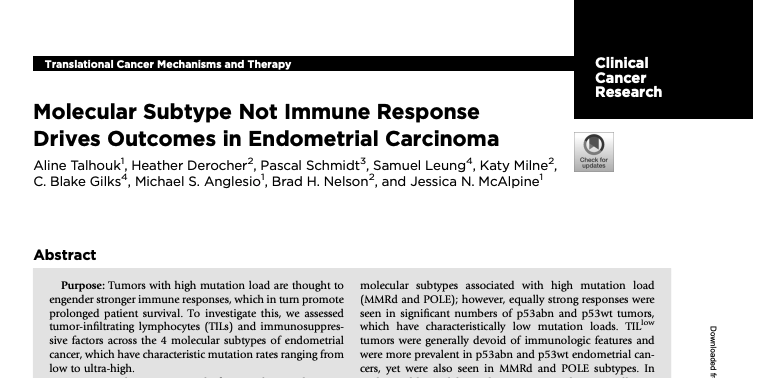
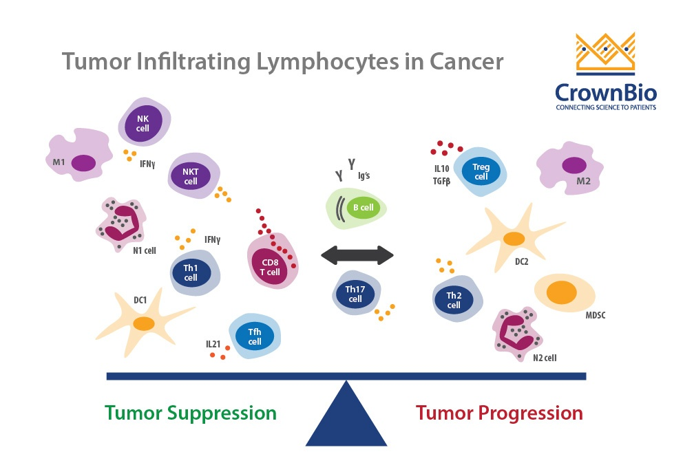
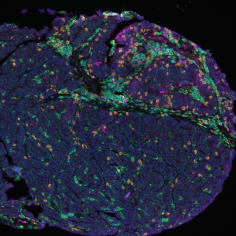
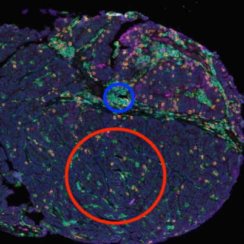
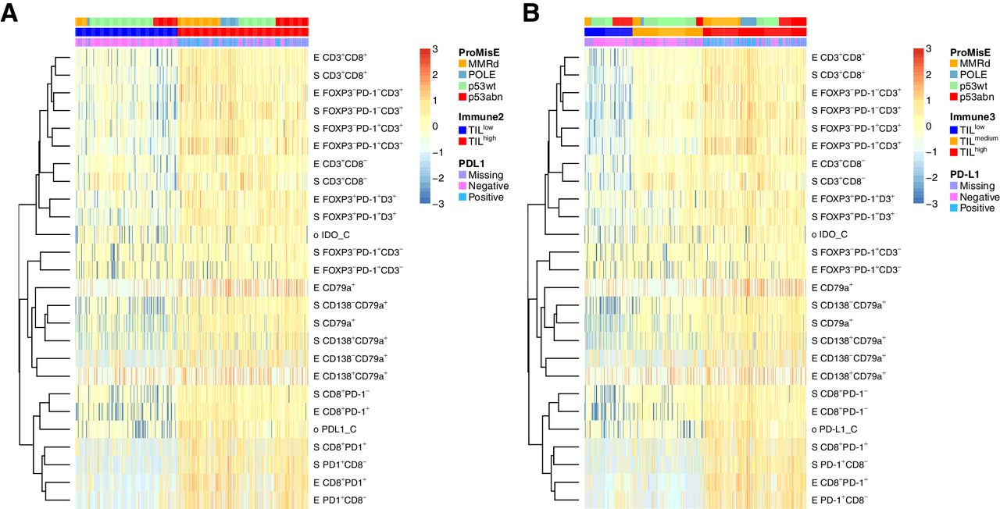

```{r include = FALSE}
knitr::knit_child("../../notebooks/b_t_analysis.Rmd")
```

```{r, include=FALSE}
knitr::opts_chunk$set(echo = FALSE, tidy = TRUE, warning = FALSE, message = FALSE, cache = TRUE, cache.lazy = FALSE, fig.width = 8, fig.height = 4.5)
```

# Main slides

## Endometrial cancer: molecular subtype is king

```{r, out.width = '90%', fig.cap='Talhouk et al. CCR 2019'}

```

## Tumour-infiltrating lymphocytes (TILs) in solid cancers

Across most solid tumour types, intratumoural cytotoxic T lymphocytes are associated with longer survival. 

```{r, out.width = '45%', fig.cap='Raskov et al. BJC 2021'}
knitr::include_graphics('images/cytotoxic_tcell_nature.png')
```

## Motivation

<br />
<br />

* TILs are associated with longer survival in most cancer types (including high-grade serous ovarian cancer) $\Rightarrow$ why not p53abn endometrial carcinomas?
  <br />
  <br />
  <br />
  <br />
* p53abn endometrial carcinomas have the worst outcomes $\Rightarrow$ could these benefit from immunotherapy? 


## Functions of different TIL subsets

```{r, out.width = '75%', fig.align = 'center'}

```

## Multi-channel immunofluorescence enables quantitation of immune cell subtypes

```{r, out.width = '45%', fig.align = 'center'}

```

## Multi-channel immunofluorescence enables quantitation of immune cell subtypes

```{r, out.width = '45%', fig.align = 'center'}

```

## Data

```{r}
metatable_bt <- til_data %>%
  dplyr::select(tma, acc_num) %>%
  mutate(`B & T` = TRUE,
         tma=str_replace_all(tma, "[AB]$", "")) %>%
  unique

metatable_clinical <- clinical_data_unique %>%
  dplyr::select(cohort, acc_num, age_dx, eclass2_ngs, stage_full, grade_rev, hist_rev, lvi, nodes, myo, neoadj, chemo, rt, brachy) %>%
  unique

angio_tab <- read_tsv("../../results/non_erg_data.tsv")

metatable_angio <- angio_tab %>%
  dplyr::select(tma, acc_num) %>%
  mutate(angiogenesis = TRUE,
         tma=str_replace_all(tma, "[AB]$", "")) %>%
  unique

colorscheme_brewer <- function(x, palname) {
  a <- brewer.pal(length(unique(na.omit(x))), palname)
  names(a) <- unique(na.omit(sort(x)))
  return(a)
}

metatable_full <- metatable_bt %>%
  full_join(metatable_angio) %>%
  full_join(metatable_clinical) %>%
  mutate(
    angiogenesis = replace_na(angiogenesis, FALSE),
    `B & T` = replace_na(`B & T`, FALSE)
  ) %>%
  filter(!is.na(tma), !is.na(acc_num)) %>%
  mutate(stage_main=str_extract(stage_full, "I*V*"),
         grade_rev = str_extract(grade_rev, "[0-9]+")) %>%
  dplyr::select(-c(stage_full)) %>%
  rename(TMA=tma, Cohort=cohort, Subtype=eclass2_ngs, Angiogenesis=angiogenesis, Age=age_dx, Stage=stage_main, Grade=grade_rev, Histotype=hist_rev,
         LVI=lvi, Nodes=nodes, Myo=myo, Neoadjuvant=neoadj, Chemotherapy=chemo, Radiotherapy=rt, Brachytherapy=brachy) %>%
  mutate(
    TMA = factor(TMA, levels = c("10-005", "10-006", "22-004")),
    `B & T` = factor(dplyr::recode(as.character(`B & T`), 'FALSE'='No', 'TRUE'='Yes'), levels = c('Yes', 'No')),
    Angiogenesis = factor(dplyr::recode(as.character(Angiogenesis), 'FALSE'='No', 'TRUE'='Yes'), levels = c('Yes', 'No')),
    Grade = factor(Grade, levels = c("1", "2", "3")),
    LVI = factor(LVI, levels = c("negative","focal", "positive", "extensive")),
    Nodes = factor(Nodes, levels = c("negative", "positive", "not tested")),
    Myo = factor(Myo, levels = c("none", "1-50%", ">50%")),
    Neoadjuvant = factor(Neoadjuvant, levels = c("chemo only", "horm only", "RT only", "yes/NOS", "none")),
    Chemotherapy = factor(dplyr::recode(as.character(Chemotherapy), 'FALSE'='No', 'TRUE'='Yes'), levels = c('Yes', 'No')),
    Radiotherapy = factor(dplyr::recode(as.character(Radiotherapy), 'FALSE'='No', 'TRUE'='Yes'), levels = c('Yes', 'No')),
    Brachytherapy = factor(dplyr::recode(as.character(Brachytherapy), 'FALSE'='No', 'TRUE'='Yes'), levels = c('Yes', 'No')),
    Stage = factor(Stage, levels = c("I", "II", "III", "IV"))
  ) %>%
  arrange(TMA, Subtype, Cohort)

cohort_plot_bottom <- columnAnnotation(df = metatable_full %>% dplyr::select(-c(acc_num, TMA, `B & T`, Angiogenesis)) %>% as.data.frame, 
                                       col = list(
                                         Cohort=c("Cross Canada"="#D90368",
                                                  "Historic Vancouver"="#7F95D1"),
                                         Age=colorRamp2(c(min(metatable_full$Age, na.rm = TRUE),  max(metatable_full$Age, na.rm = TRUE)), c("white", "#2E294E")),
                                         Subtype=colorscheme_brewer(metatable_full$Subtype, 'Set2'),
                                         Grade=colorscheme_brewer(metatable_full$Grade, 'Oranges'),
                                         Histotype=colorscheme_brewer(metatable_full$Histotype, 'Set3'),
                                         LVI=colorscheme_brewer(metatable_full$LVI, 'Purples'),
                                         Nodes=c("negative"="#E6EBE0", "positive"="#36C9C6", "not tested"="#696773"),
                                         Myo=colorscheme_brewer(metatable_full$Myo, 'Reds'),
                                         Neoadjuvant=colorscheme_brewer(metatable_full$Neoadjuvant, 'Set2'),
                                         Chemotherapy=c('Yes'="#2E282A",
                                                        'No'="#E7ECEF"),
                                         Radiotherapy=c('Yes'="#2E282A",
                                                        'No'="#E7ECEF"),
                                         Brachytherapy=c('Yes'="#2E282A",
                                                         'No'="#E7ECEF"),
                                         Stage=colorscheme_brewer(metatable_full$Stage, 'Reds')
                                       ))
cohort_plot_top <- columnAnnotation(df = metatable_full %>% dplyr::select(c(TMA, `B & T`, Angiogenesis)) %>% as.data.frame, 
                                    col = list(
                                      TMA=c("10-005"="#88A096",
                                            "10-006"="#BBAB8B",
                                            "22-004"="#8A4F7D"),
                                      `B & T`=c('Yes'="#2E282A",
                                                'No'="#E7ECEF"),
                                      Angiogenesis=c('Yes'="#2E282A",
                                                     'No'="#E7ECEF")
                                    ))
```

```{r, fig.width = 19, fig.height = 7, fig.align = 'center'}
cohort_track <- Heatmap(matrix(nc = nrow(metatable_full), nr = 0), 
	top_annotation = cohort_plot_top, bottom_annotation = cohort_plot_bottom)

draw(cohort_track, annotation_legend_side = "bottom")
```


```{r}
density_map <- c(dens_bcell_cd20pos_tumour="Tumour: B cell",
                 dens_bcell_cd20neg_tumour="Tumour: Plasma",
                 dens_tcyto_tumour="Tumour: CD8+",
                 dens_thelper_tumour="Tumour: CD4+",
                 dens_treg_tumour="Tumour: Treg",
                 dens_bcell_cd20pos_stroma="Stroma: B cell",
                 dens_bcell_cd20neg_stroma="Stroma: Plasma",
                 dens_tcyto_stroma="Stroma: CD8+",
                 dens_thelper_stroma="Stroma: CD4+",
                 dens_treg_stroma="Stroma: Treg")
```

## Mixture modeling of TIL counts

We describe TIL counts $y_{i,c,r}$ for a given core $i$, cell type $t$, and region (tumour/stroma) $r$ as follows:

$$
y_{i,t,r} \sim \mathcal{NB}(\mu_{i,t,r}, \alpha_{i,t,r})
$$

where the mean $\mu_{i,t,r}$ is **proportional to the TMA core's area** $A$ and a latent variable $z$ for each cluster:

$$
\begin{aligned}
\mu_{i,t,r} &= A_{i,r} z_{c_i,t,r} \\
z_{c,t,r} &\sim \mathcal{Gamma}(\bar{\mu}_{t,r}, 100)
\end{aligned}
$$
Then, we leverage the proportionality between the Cox likelihood and a Poisson likelihood to incorporate uncertainty in cluster assignment into the survival analysis. 

$$
\begin{aligned}
\lambda_0 &\sim \mathcal{Gamma}(0.1, 0.1) \\
\lambda_i &= \lambda_0\exp(\sum_v \beta_{v,i}x_{v,i}) \\
d_i &\sim \mathcal{Poisson}(\lambda_i * p_i)
\end{aligned}
$$

## Mixture model-based clustering of TIL densities

```{r}
density_heatmaps <- lapply(outcomes, function(outcome_type) {
  row_anno <- clinical_anno[rownames(til_densities_heatmap[[outcome_type]]$mat),] %>%
    bind_cols(til_densities_heatmap[[outcome_type]]$clust) %>%
    mutate(hist_rev = case_when(
      hist_rev %in% names(hist_mapping) ~ hist_mapping[hist_rev],
      TRUE ~ hist_rev 
    ),
    clust=factor(clust)) %>%
    rename(
      TMA=tma,
      Grade=grade_rev,
      Histotype=hist_rev,
      Neoadjuvant=neoadj,
      Subtype=eclass2_ngs,
      TILclust=clust
    )
  
  clust_color_map <- c('0'='#60B2E5',
                       '1'='#A4031F')
  
  ha <- rowAnnotation(df = row_anno, annotation_width = 0.02,
                      col = list(
                        TILclust=clust_color_map
                      ))
  col_fun <- colorRamp2(c(-2, 0, 2), c("blue", "white", "red"))
  
  density_map2 <- density_map
  names(density_map2) <- str_replace_all(names(density_map2), "^dens_", "")
  
  mat <- sqrt(exp(til_densities_heatmap[[outcome_type]]$mat)-1) %>% scale
  colnames(mat) <- dplyr::recode(colnames(mat), !!!density_map2)
  mat <- mat[,!str_detect(colnames(mat), "cd8tcell_foxp3pos")]
  
  density_heatmap <- Heatmap(mat,
                             na_col = "gray",
                             column_names_gp = gpar(fontsize = 6), 
                             cluster_rows = TRUE,
                             cluster_columns = FALSE,
                             column_names_rot = 45, 
                             show_row_names = FALSE, 
                             clustering_method_rows = "ward.D2", 
                             clustering_method_columns = "ward.D2",
                             row_split = row_anno$clust) + ha
  return(density_heatmap)
})
names(density_heatmaps) <- outcomes
```

```{r, fig.width = 10, fig.height = 5, fig.align = 'center'}
draw(density_heatmaps$os, heatmap_legend_side = "right")
```

## High TILs are associated with significantly longer survival in p53abn EC

```{r, fig.width = 7, fig.height = 5, fig.align = 'center'}
ggplot(trace_summaries_renamed, aes(y=variable, group=outcome, colour=outcome)) + 
  geom_point(aes(x=exp(log.estimate)), position=position_dodge(width=0.5), shape=15, size=3) + 
  geom_linerange(aes(xmin=exp(log.conf.low), xmax=exp(log.conf.high)), position=position_dodge(width=0.5)) + 
  theme_pubr() + 
  geom_vline(xintercept = c(0.1, 0.2, 0.5, 2, 4, 8), linetype = 3) + 
  geom_vline(xintercept = 1, alpha = 0.7) + 
  facet_col(~ category, scales = "free_y", space = "free", strip.position = "left") + 
  theme(strip.placement = "outside", strip.background = element_blank(), strip.text = element_text(face = "bold")) + 
  ylab("") + 
  scale_y_discrete(limits = rev) + 
  scale_colour_manual(values = brewer.pal(3, "Set2")) + 
  xlab("Hazard ratio") + 
  scale_x_continuous(trans = "log", breaks = c(0.1, 0.2, 0.5, 1, 2, 4, 8))
```

OS: *P = * `r with(survmodel_results$os_trace_table, sum(beta_clust_1 >= 0)/nrow(survmodel_results$os_trace_table))`; PFS: *P = * `r with(survmodel_results$pfs_trace_table, sum(beta_clust_1 >= 0)/nrow(survmodel_results$pfs_trace_table))`; DSS: *P = * `r with(survmodel_results$dss_trace_table, sum(beta_clust_1 >= 0)/nrow(survmodel_results$dss_trace_table))`. 

  


# Extra slides

## Graphical model

```{tikz, fig.ext = 'png', echo = FALSE, fig.align = 'center'}
\usetikzlibrary{bayesnet}
\begin{tikzpicture}[x=1.7cm,y=1.8cm]

    % Nodes
  
    \node[obs]                   (y)      {$y$} ; %
    \node[latent, above=.4 of y]    (mu)      {$\mu$} ; %
    \node[latent, left=.2 of y] (alpha) {$\alpha$} ;


    \node[obs, left= .4 of mu] (A) {$A$} ;
    \node[latent, above = .4 of mu] (z) {$z$} ;

    \node[latent, right = 0.3 of mu] (clust) {$c$} ;

    \node[det, right = 0.8 of clust, minimum size=.1pt] (xbetadot) {$\odot$} ;
    \node[obs, above right= .4 of xbetadot] (beta) {$\beta$} ;
    \node[latent, above left = .4 of xbetadot] (x) {$x$} ;


    

    \node[obs, below = .6 of xbetadot] (d) {$d, p$} ;

  
    \edge{mu} {alpha};
    \edge{mu,alpha} {y};
    \edge{A,z,clust} {mu} ;
    \edge{x, beta, clust} {xbetadot} ;
    \edge{xbetadot} {d} ;

    

    \plate {covariate} {(x) (beta) (xbetadot)} {$V$} ;
    \plate {cluster} {(z)} {$C$} ;
    \plate {region} {(A) (z) (mu) (y) (alpha) (cluster)} {$R$} ;
    \plate {core} {(A) (mu) (alpha) (y) (clust) (d) (region) (x) (xbetadot)} {$N$} ;
    % \plate {gene} {(beta) (delta) (rho) (mu) (alpha) (y) (cell.south east)} {$G$} ;
  

  
  \end{tikzpicture}
```

## Densities of all TIL types are highly correlated

TIL densities are all highly correlated with each other. 

```{r, fig.width=6, fig.height=6, fig.align = 'center'}
ggcorrplot(dens_cors$r, 
           hc.order = TRUE,
           type = "lower",
           p.mat = dens_cors$P) + 
  theme(axis.text.x = element_text(size = 8),
        axis.text.y = element_text(size = 8))
```


## Multivariate survival analysis: TIL densities

```{r, fig.width = 10, fig.height = 5, fig.align = 'center'}
ggplot(cox_fits_tilvariables %>% filter(variable == "value"), aes(x=model_run, group=outcome, colour=outcome)) + 
  geom_point(aes(y=`exp(coef)`), position=position_dodge(width=0.5), shape=15, size=3) + 
  geom_linerange(aes(ymin=`lower .95`, ymax=`upper .95`), position=position_dodge(width=0.5)) + 
  theme_pubr() + 
  geom_hline(yintercept = c(0.1, 0.2, 0.5, 2, 4), linetype = 3) + 
  geom_hline(yintercept = 1, alpha = 0.7) + 
  xlab("") + 
  scale_x_discrete(limits = rev) + 
  scale_colour_manual(values = brewer.pal(3, "Set2")) + 
  ylab("Hazard ratio") + 
  scale_y_continuous(trans = "log", breaks = c(0.1, 0.2, 0.5, 1, 2, 4)) + 
  theme(axis.text.x = element_text(angle = 75, hjust = 1, size = 8))
```


## Talhouk et al. Figure 3

```{r, out.width = '90%', fig.cap='Talhouk et al. CCR 2019'}

```

